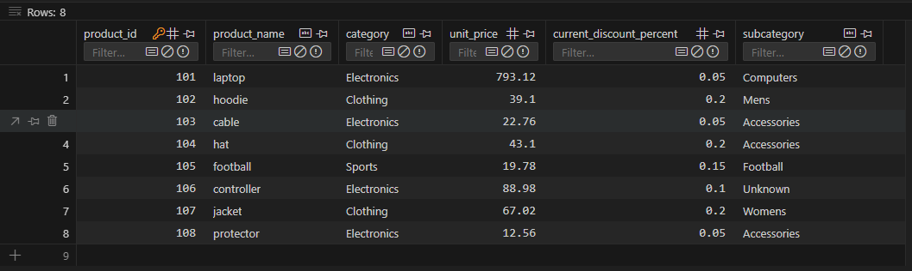

# Smart Store Project - Exploring Business Intelligence and Insights
### Author: Brett

## Table of Contents
- [Project Initialization](#project-initialization)
- [Data Cleaning Process](#data-cleaning-process)
- [Data Warehouse Creation](#data-warehouse-creation)
- [Database Schema](#database-schema)
- [Power BI Reporting and Analysis](#reporting-and-analysis-power-bi)
- [OLAP Project: Smart Sales Analysis](#olap-project-smart-sales-analysis)

# Project Setup

## Project Initialization

### Create a GitHub Repository
- Create a new repo on GitHub and add a default README.

### Clone the Repository
```shell
git clone [your-repo-url]
cd [cloned-repo]
```

### Add `.gitignore` and `requirements.txt` Files
- Add `.gitignore` and `requirements.txt` to the project.

### Create and Activate a Virtual Environment
```shell
python -m venv .venv
.\.venv\Scripts\Activate
```

### Upgrade Pip, Setuptools, and Wheel
```shell
py -m pip install --upgrade pip setuptools wheel
```

### Install Dependencies
```shell
pip install -r requirements.txt
```

### Track and Push Changes with Git
```shell
git add .
git commit -m "Initial commit"
git push origin main
```

## Data Cleaning Process

### Data Cleaning Scripts

Scripts were developed to clean data and perform the following operations:

- **Remove Duplicates**: Eliminate any duplicate records.
- **Handle Missing Values**: Address missing data through imputation.
- **Standardize Formatting**: Apply consistent casing and whitespace trimming.
- **Parse Dates**: Convert date fields into a standardized datetime format.

To execute a script within the `scripts` folder:

```shell
py scripts\data_prep.py
```

## Data Warehouse Creation

### Overview

The cleaned data is loaded into a SQLite data warehouse (`smart_sales.db`) located in the `data/dw` directory. The warehouse includes three main tables:

- `customer`
- `product`
- `sale`

These tables are recreated each time the ETL script is run to ensure consistency.

### Running the ETL Script

To create the database, tables, and insert data from the cleaned CSV files:

```shell
py scripts\etl_to_dw.py
```
## Database Schema

### `customer` Table

| Column Name              | Data Type | Description                          |
|--------------------------|-----------|--------------------------------------|
| customer_id              | INTEGER   | Primary key                          |
| name                     | TEXT      | Customer's full name                 |
| region                   | TEXT      | Region where customer resides        |
| join_date                | TEXT      | Date the customer joined             |
| last_active_year         | DATE      | Last year the customer was active    |
| preferred_contact_method | TEXT      | Preferred communication method       |

---

### `product` Table

| Column Name              | Data Type | Description                                |
|--------------------------|-----------|--------------------------------------------|
| product_id               | INTEGER   | Primary key                                |
| product_name             | TEXT      | Name of the product                        |
| category                 | TEXT      | Main product category                      |
| unit_price               | REAL      | Price per unit                             |
| current_discount_percent | REAL      | Current discount percentage on the product |
| subcategory              | TEXT      | Subcategory under the main category        |

---

### `sale` Table

| Column Name   | Data Type | Description                                |
|---------------|-----------|--------------------------------------------|
| sale_id       | INTEGER   | Primary key                                |
| sale_date     | DATE      | Date the sale occurred                     |
| customer_id   | INTEGER   | Foreign key referencing `customer` table   |
| product_id    | INTEGER   | Foreign key referencing `product` table    |
| store_id      | INTEGER   | ID of the store where sale happened        |
| campaign_id   | INTEGER   | ID of the marketing campaign               |
| sale_amount   | REAL      | Total amount of the sale                   |
| bonus_points  | INTEGER   | Points earned from the purchase            |
| payment_type  | TEXT      | Payment method used                        |


## Table Previews
- These screenshots provide a glimpse of the data tables before analysis

### Customer Table


### Product Table


### Sale Table


## Notes

- This project uses `pandas` for data manipulation and `sqlite3` for database interactions.
- The ETL process is repeatable and can be run multiple times without manual cleanup.
- The resulting SQLite database can be queried directly or connected to BI tools for further analysis.

---

## Reporting and Analysis (Power BI)

- Connected `smart_sales.db` to Power BI using ODBC (`SmartSalesDSN`) and loaded the `customer`, `product`, and `sale` tables  
- Opened Power Query Editor and wrote a SQL query to calculate total spent by each customer:  
  ```sql
  SELECT c.name, SUM(s.sale_amount) AS total_spent
  FROM sale s
  JOIN customer c ON s.customer_id = c.customer_id
  GROUP BY c.name
  ORDER BY total_spent DESC;
  ```

- Created a query named `top_customers` based on the result and used it in visuals  
- Added calculated columns to extract `Year`, `Quarter`, and `Month Name` from `sale_date`  
- Used slicers for filtering by `Month Name`, `Quarter`, `Year`, and `category`  
- Created a matrix visual to explore unit prices by product `category` and `subcategory`  
- Designed a bar chart to show top customers by `sale_amount`  
- Built a bar chart for total `sale_amount` by `Month Name`  
- Ensured all visuals were interactive and filtered by slicer selections  

### Power BI Model View


### Query Results


### Final Dashboard


---

# OLAP Project: Smart Sales Analysis

## Section 1. The Business Goal

The goal of this analysis is to identify the top-selling products and trends in sales across different product categories and time periods. This insight can help guide decisions related to inventory planning, marketing focus, and production prioritization.

---

## Section 2. Data Source

The data was accessed through a prepared data warehouse using an ODBC connection. Two main tables were used:

- **sale**: `sale_id`, `sale_date`, `sale_amount`
- **product**: `product_id`, `product_name`, `category`

From these tables, measures such as total sales amount and total units sold were calculated and joined based on matching keys.

---

## Section 3. Tools

Power BI was used to connect to the data warehouse, create data queries, and perform the OLAP-style analysis. Power BI was selected for its ability to provide visual slicing, dicing, and drilldown functionality without requiring code, while also producing interactive dashboards.

---

## Section 4. Workflow & Logic

**Dimensions used:**
- **Product category** (from the product table)
- **Region** (from the customer table)
- **Time** (extracted from `sale_date` as year, quarter, and month)

**Metrics:**
- **Total Sales Amount**: Sum of `sale_amount`
- **Units Sold**: Count of `sale_id`

**OLAP techniques:**
- **Slicing** by year, quarter, and month using slicers
- **Dicing** by category and region within visualizations and matrix tables
- **Drilldown** enabled from year to quarter and month where applicable

**Visuals include:**
- Bar chart for total sales by product
- Line chart for monthly sales trends by category
- Matrix table to compare product and category-level totals

---

### Dashboard: Top Products by Units Sold


This dashboard highlights the top 5 products based on units sold and compares product-category combinations in a matrix table.

---

### Dashboard: Total Sales by Product, Category, and Time


This page displays sales totals by product and category, along with monthly sales trends using a line chart and a matrix breakdown by product.

---

## Section 5. Results

- Electronics category generated the highest total revenue, primarily driven by laptop sales.
- Clothing had a higher number of units sold overall, though with lower average sale amounts.
- Sales were highest in July and April, with noticeable declines in August and October.
- Most of the top five products by units sold came from two categories: Clothing and Electronics.

---

## Section 6. Suggested Business Action

- Maintain high inventory levels for top-performing products, especially laptops and jackets.
- Re-evaluate marketing or pricing strategies for lower-performing products.
- Use seasonality trends to plan future promotions and stock levels.

---

## Section 7. Challenges

Initial difficulty occurred when creating a new aggregated table in Power BI using SQL. After reviewing the data source setup, a corrected ODBC configuration was used to successfully query and build separate tables for top products and top customers. Additionally, slicer formatting and visual layout adjustments were made to create a clean and consistent dashboard experience.